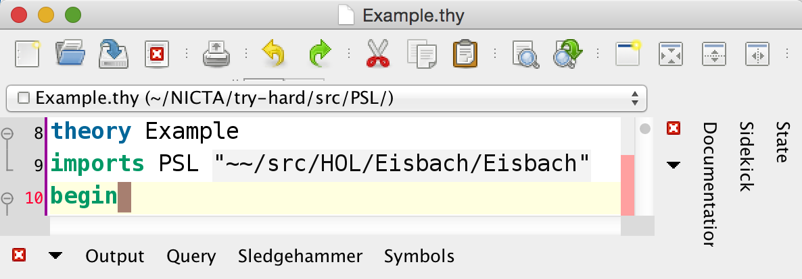
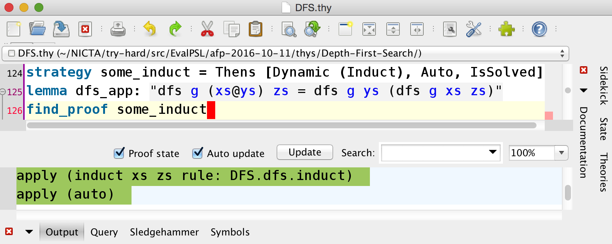

**This branch PaMpeR contains a Proof Method Recommendation system, PaMpeR. Please import PaMpeR/PaMpeR.thy to your theory file to elicit recommendations from PaMpeR.**

# PSL

This repository contains the implementation of *proof strategy language (PSL)* and its default strategy,
**try_hard**, for Isabelle2017. Note that Isabelle2016 and Isabelle2016-1 are no longer supported.

## Installation
1. Install [Isabelle2017](https://isabelle.in.tum.de/).
2. Download or clone this repository (git clone https://github.com/data61/PSL.git).
3. Then, Users can install PSL and try_hard by importing *.PSL.thy* to their theory files
   with the Isabelle keyword, **imports**.

## Basic Commands
- The keyword **strategy** defines a new strategy.
- The keyword **find_proof** invokes PLS's runtime system searching for a proof based on a given strategy.
- The keyword **try_hard** searches for a proof based on the default strategy. Upon success, it discharges the first fub-goal or all the sub-goals in a given proof obligation.
- The keyword **try_hard_one** is similar to try_hard, but focuses only on the first sub-goal.
- The keyword **try_hard_all** is similar to try_hard, but tries to discharge all sub-goals.
- The keyword **try_parallel** is similar to try_hard, but exploits parallelism.

## Hints
PSL's runtime tactic generation can result in a large number of messages in Isabelle/jEdit's output panel.
This might cause Isabelle/jEdit to pause PSL's proof search after reaching its default upper limit for tracing messages.
- One can circumvent this situation by changing the upper limit to an extreamly large number, say 99999999.
- One can change the upper limit for tracing messages via jEdit's menus:
  Plugin Options => Isabelle => General => Editor Reactivity => Editor Tracing Messages.

## Contents
- *.src/Utils.ML*                     includes various utility functions.
- *.src/Subtool.ML*                   treats Isabelle's subtools as state-monad tactics.
- *.src/Dynamic_Tactic_Generation.ML* facilitates runtime tactic generation.
- *.src/Constructor_Class.ML/*        is a general purpose constructor class library.
- *.src/Instantiation.ML*             instantiates some type constructors as members of constructor classes.
- *.src/Monadic_Prover.ML*            contains the interpreter of PSL.
- *.src/Parser_Combinator.ML*         contains general purpose monadic parser combinators.
- *.src/PSL_Parser.ML*                defines the PSL parser.
- *.src/Isar_Interface.thy*           sets up the Isabelle/Isar interface for PSL.
- *.src/Try_Hard.thy*                defines the default strategy try_hard.
- *./PSL.thy*                         reads all the necessary files to use PSL and try_hard.
- *./Example*                         presents small example strategies and use cases.

## FAQs
*Q1.* Why yet another tactic language? How is PSL different from, say, Eisbach?

*A1.* PSL’s runtime system attempts to generate efficient proof scripts from a given strategy by searching for the appropriate specialisation and combination of tactics for a particular conjecture without direct user interaction. Eisbach does not generate methods dynamically, trace proof attempts, nor support parallelism natively. Eisbach is good when engineers already know how to prove their conjecture in Isabelle, while PSL is good when they want to find out how to prove it.

*Q2.* To be honest, I do not have time to learn a new language. Can I still use PSL without learning its syntax?

*A2.* We made PSL’s syntax similar to that of Isabelle’s tactic language to lower the learning barrier of PSL. But if you do not feel writing your custom strategy, enter *try_hard*. It invokes the default strategy, TryHard. The lack of input from human engineers on the proof obligation at hand makes the TryHard less specific to each conjecture; however, we made try hard more powerful than existing proof automation tools for Isabelle by specifying larger search spaces.

*Q3.* How much computational resources do I need to use PSL / try_hard?

*A3.* The more is the better. You can increase the power of your strategy by using parallel combinators, such as *POrs* and *PAlts*.

*Q4.* It looks like PSL's proof search got stuck due to the high volume of traing messages. How can I keep it running?

*A4.* You can change the upper limit for tracing messages via jEdit's menus: Plugin Options => Isabelle => General => Editor Reactivity => Editor Tracing Messages.

*Q5.* try_hard keeps running for more than five minutes. How long should I wait to get a proof for this conjecture?

*A5.* It depends on how difficult your conjecture is. try_hard starts with simple proof strategies that usually do not take much time and tries more time consuming strategies if simple strategies cannot find a proof. If it keeps running for more than six hours, I would start writing proofs manually.

*Q6.* Why try_hard? Why not sledgehammer?

*A6.* sledgehammer is good when you want to get a proof quickly, while try_hard is good when you have a longer time for proof search. [Our evaluation](https://arxiv.org/abs/1606.02941) shows that given 300 seconds of time-out for each proof goal try_hard solves 1115 proof goals out of 1526, while sledgehammer found proofs for 901 of them using the same computational resources and re-constructed proofs in Isabelle for 866 of them. This is a 14 percentage point improvement of proof search and a 16 percentage point increase for proof reconstruction. Moreover, 299 goals (20% of all goals) were solved only by try_hard within 300 seconds. try_hard is especially good at discharging proof obligations that can be nicely handled by by a) mathematical (co)induction, b) general simplification rules, or c) specialised tactics.

## Documentations
For more details, please read the paper [A Proof Strategy Language and Proof Script Generation for Isabelle/HOL](https://arxiv.org/abs/1606.02941) available at arXiv.org.

## Screenshot

